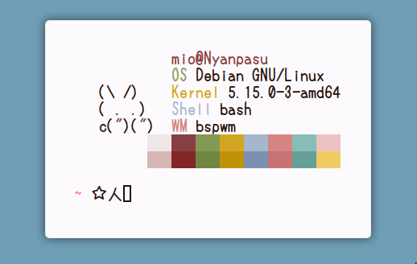

<h1>Dotfiles ☆ ～('▽^人)</h1>

Mainly serves as just a backup of various configuration files

+ **WM**:BSPWM
+ **Shell**: bash
+ **Terminal**: alacritty
+ **Editor**: Vim
+ **Launcher**: Rofi
+ **Browser**: Chrome

## Screenshots 🌺

Tabs in BSPWM, through <a href="https://gist.github.com/jpentland/468a42c172eb607bb950f5d00606312c">tabc</a>

Polybar tasklist -<a href="https://github.com/tam-carre/polywins">Polywins</a>

 Thanks to <a href="https://github.com/Gitleptune">Gitleptune</a> for making the readme presentable

